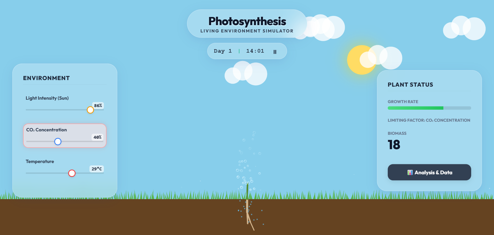
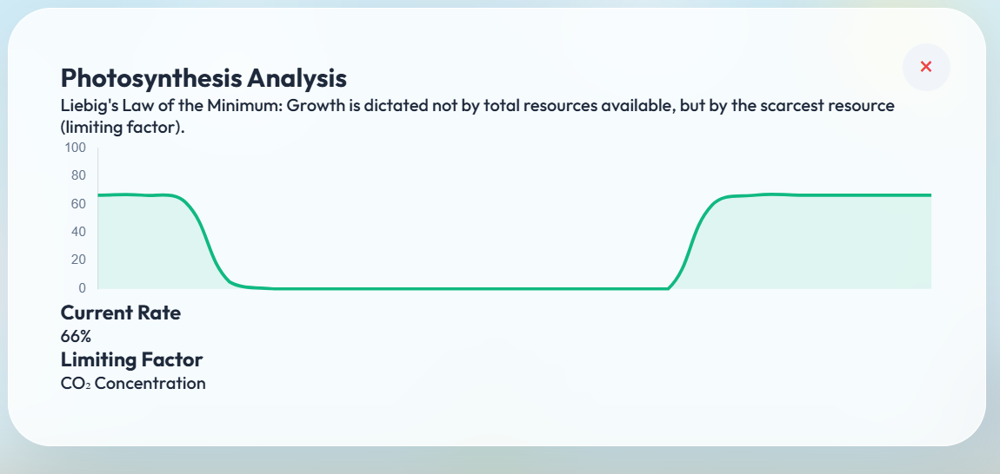

# Photosynthesis: Living Environment Simulator 🌿

A gamified, interactive biology simulation that brings the science of photosynthesis to life through procedural art and real-time data visualization.



## 🚀 Overview

This project was built to bridge the gap between static textbook learning and interactive gaming. It simulates a living plant in a dynamic digital environment where users must balance light, CO₂, and temperature to maximize growth, demonstrating **Liebig's Law of the Minimum**.

## ✨ Key Features

### 🌍 Living Environment
- **24-Hour Day/Night Cycle:** Watch the sun rise and set in real-time. The environment reacts automatically—photosynthesis stops at night and peaks at noon.
- **Dynamic Weather & Lighting:** The sky changes color from dawn to dusk, and atmospheric particles (Oxygen bubbles, CO₂) float through the air.
- **Reactive Terrain:** Grass lushness and color react dynamically to temperature stress.

### 🧬 Procedural Biology
- **Fractal Root System:** Roots aren't pre-drawn images. They are generated procedurally using fractal algorithms, growing "wildly" and deeply into the soil as the plant matures.
- **Organic Growth:** The plant uses Bezier curves and sine-wave physics to sway gently in the wind, growing organically leaf by leaf.
- **Limiting Factors:** Real-time logic calculates growth based on the scarcest resource (Light, CO₂, or Temperature).

### 🎨 Modern UI/UX
- **Glassmorphism Design:** A sleek, translucent interface ("Glassy Fog") that feels premium and modern.
- **Responsive Hybrid Layout:** Works seamlessly on Desktop (Side Panels) and Mobile (Popup Panels).
- **Data Visualization:** Built-in Line Charts visualize photosynthesis efficiency in real-time.

## 📸 Screenshots

| Day Mode | Night Mode | Analysis Detail |
|----------|------------|--------------|
|  |  |  |

## 🛠️ Tech Stack

- **Core:** HTML5, CSS3, Vanilla JavaScript (ES6+)
- **Rendering:** [p5.js](https://p5js.org/) (Canvas manipulation, procedural generation)
- **Data Viz:** [Chart.js](https://www.chartjs.org/) (Real-time graphs)
- **Styling:** CSS variables, Flexbox, Backdrop Filters

## 🎮 How to Run

1.  **Clone the Repository**
    ```bash
    git clone https://github.com/BhanuPrakashYarajarla/Photosynthesis-Living-Environment-Simulator.git
    ```
2.  **Open the Project**
    -   Simply open `index.html` in any modern web browser.
    -   No build step or server required!

## 🕹️ Controls

-   **Auto-Play:** By default, the simulation runs a 24-hour cycle. Sit back and watch!
-   **Manual Override:** Touch any slider (Light, CO₂, Temp) to pause the clock and manually experiment with extremes.
-   **Pause/Play:** Use the button in the header to toggle the day/night cycle.
